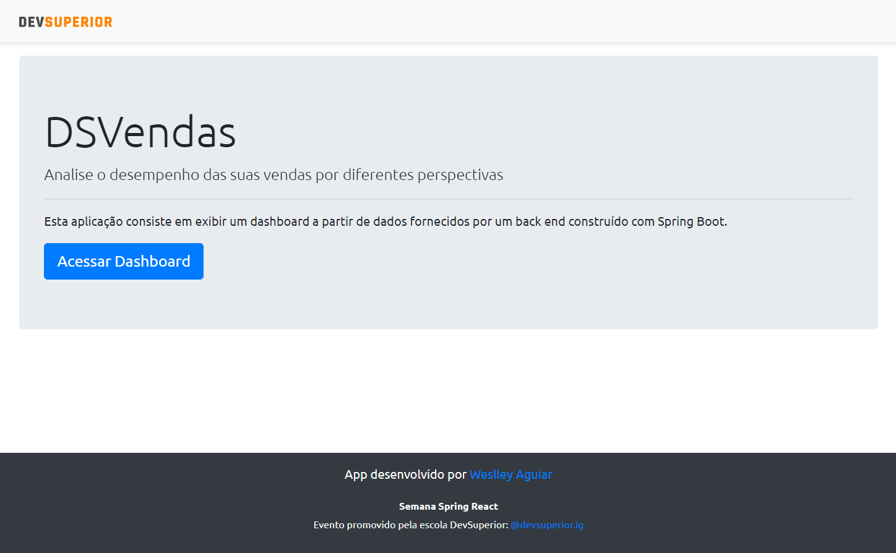

# DSVendas

[](https://wesraiuga-sds3.netlify.app/)
[](https://github.com/WesRaiuga/projeto-sds3/blob/main/LICENSE) 

<br/>

# Sobre o projeto

https://wesraiuga-sds3.netlify.app/

DSVendas é uma aplicação full stack web construída durante a 3ª edição da **Semana DevSuperior** (sds3), evento organizado pela [DevSuperior](https://devsuperior.com "Site da DevSuperior").

A aplicação consiste em um dashboard de vendas, previamente cadastradas no banco de dados, apresentando gráficos de Taxa de sucesso e Total de vendas, por vendedor, além de uma tabela paginada com informações sobre todas as vendas.

## Layout web



## Modelo conceitual


<br/>

# Tecnologias utilizadas
## Back end
- Java
- Spring Framework
- Maven
## Front end
- ReactJS / TypeScript
- Bootstrap
- Apex Charts
- Axios
## Implantação em produção
- Back end: Heroku
- Front end web: Netlify
- Banco de dados: Postgresql

<br/>

# Como executar o projeto

## Back end
Pré-requisitos: Java 11

```bash
# clonar repositório
git clone https://github.com/WesRaiuga/projeto-sds3.git

# entrar na pasta do projeto backend
cd projeto-sds3/backend

# executar o projeto
./mvnw spring-boot:run
```

## Front end
Pré-requisitos: npm / yarn

```bash
# clonar repositório
git clone https://github.com/WesRaiuga/projeto-sds3.git

# entrar na pasta do projeto frontend
cd projeto-sds3/frontend

# instalar dependências
yarn install

# executar o projeto
yarn start
```

<br/>

# Autor

Weslley Alves de Aguiar

[](https://www.linkedin.com/in/wesraiuga/)

<br/>

# Referência e agradecimentos

- [DevSuperior](https://devsuperior.com "Site da DevSuperior")
- [Professor Nelio Alves](https://www.youtube.com/c/DevSuperior/featured "Canal no youtube da DevSuperior")